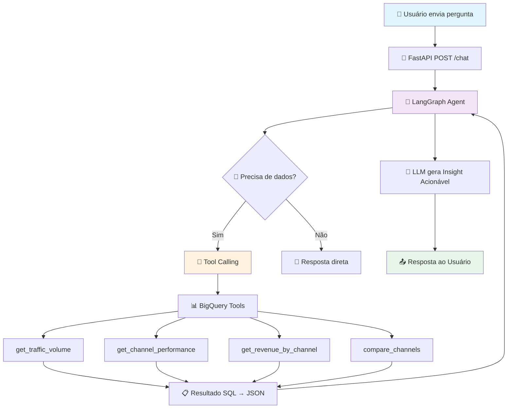

# 🤖 CaseMonks — Agente Analista de Mídia

> MVP de um Agente de IA Autônomo que atua como **Analista de Mídia Júnior**, capaz de entender perguntas em linguagem natural, consultar o BigQuery e fornecer **insights acionáveis** para times de Mídia e Growth.

---

## 🏗️ Arquitetura do Agente

O agente utiliza **Tool Calling (Function Calling)** via LangGraph — a LLM decide autonomamente quando precisa consultar o banco de dados.



### Fluxo Detalhado

1. **Identificação de Intenção** — O agente reconhece se o usuário busca volume, performance ou comparação
2. **Seleção de Ferramenta** — Via Tool Calling, o agente seleciona qual função Python executar
3. **Execução de Dados** — Queries parametrizadas no BigQuery (prevenção de SQL Injection)
4. **Processamento de Insight** — A LLM converte dados brutos em análise estratégica

---

## 🔧 Tools Implementadas

| Tool | Propósito | Quando é usada |
|------|-----------|----------------|
| `get_traffic_volume` | Volume de usuários por canal/período | "Quantos usuários vieram de Search?" |
| `get_channel_performance` | Comparação cross-channel com métricas | "Qual canal performa melhor?" |
| `get_revenue_by_channel` | Receita com breakdown mensal | "Como está o faturamento de Facebook?" |
| `compare_channels` | Resumo completo com ROI relativo | "Compare todos os canais" |

---

## 📁 Estrutura do Projeto

```
CaseMonks/
├── app/
│   ├── main.py              # FastAPI — rotas e lifespan
│   ├── config.py             # Settings com Pydantic (env vars)
│   ├── agent/
│   │   ├── graph.py          # LangGraph StateGraph
│   │   ├── state.py          # AgentState (TypedDict)
│   │   ├── nodes.py          # agent_node (LLM + tools)
│   │   └── prompts.py        # System prompt isolado
│   ├── tools/
│   │   ├── bigquery_tools.py # 4 tools com queries parametrizadas
│   │   └── schemas.py        # Pydantic schemas + dataset docs
│   └── models/
│       └── api_models.py     # Request/Response models
├── .env                      # GEMINI_API_KEY + GOOGLE_APPLICATION_CREDENTIALS
├── credentials.json          # Service Account GCP (não versionado)
├── requirements.txt          # Dependências fixas
└── README.md                 # Este arquivo
```

---

## 🚀 Setup

### Pré-requisitos

- Python 3.10+
- Conta Google Cloud com acesso ao BigQuery
- API Key do Gemini

### 1. Clone o repositório

```bash
git clone https://github.com/seu-usuario/CaseMonks.git
cd CaseMonks
```

### 2. Crie um ambiente virtual

```bash
python -m venv .venv
.venv\Scripts\activate   # Windows
# source .venv/bin/activate  # Linux/Mac
```

### 3. Instale as dependências

```bash
pip install -r requirements.txt
```

### 4. Configure as variáveis de ambiente

Crie um arquivo `.env` na raiz:

```env
GEMINI_API_KEY="sua-api-key-do-gemini"
GOOGLE_APPLICATION_CREDENTIALS="caminho/para/credentials.json"
```

### 5. Coloque o arquivo de credenciais do GCP

Baixe o JSON da Service Account do Google Cloud Console e salve como `credentials.json` na raiz do projeto.

### 6. Execute o servidor

```bash
python -m app.main
```

O servidor estará disponível em: `http://localhost:8000`

---

## 📡 Endpoints da API

### `POST /chat`

Envia uma pergunta ao agente.

**Request:**
```json
{
  "question": "Como foi o volume de usuários vindos de 'Search' no último mês?"
}
```

**Response:**
```json
{
  "answer": "📊 **Resumo Executivo**: O canal Search trouxe 1.245 usuários...",
  "tools_used": [
    {
      "tool_name": "get_traffic_volume",
      "description": "Argumentos: {traffic_source: Search, ...}"
    }
  ],
  "data": null
}
```

### `GET /health`

Health check do serviço.

### Documentação Interativa

- **Swagger UI**: `http://localhost:8000/docs`
- **ReDoc**: `http://localhost:8000/redoc`

---

## 💡 Exemplos de Perguntas

```
"Como foi o volume de usuários vindos de 'Search' no último mês?"
"Qual dos canais tem a melhor performance? E por que?"
"Compare todos os canais do último trimestre"
"Qual canal tem o melhor ROI?"
"Como está a receita de Facebook vs YouTube?"
```

---

## 🛡️ Decisões Técnicas

| Decisão | Justificativa |
|---------|---------------|
| **Gemini** (em vez de OpenAI) | API Key já disponível, sem necessidade de conta paga adicional |
| **LangGraph** (em vez de LangChain básico) | Controle explícito do fluxo com StateGraph, mais previsível |
| **Queries parametrizadas** | Prevenção de SQL Injection via `@params` do BigQuery |
| **Schema no prompt** | Evita alucinação de colunas — agente só usa colunas reais |
| **FastAPI** | Auto-documentação, tipagem, async nativo |
| **Pydantic** | Validação de entrada/saída, schemas para as tools |

---

## 📊 Dataset

O projeto consulta o dataset público **`bigquery-public-data.thelook_ecommerce`**, que simula uma loja de roupas online com dados de:

- **Usuários**: origem do tráfego (Search, Organic, Facebook, etc.)
- **Pedidos**: volume, status, datas
- **Itens**: preços de venda para cálculo de receita
